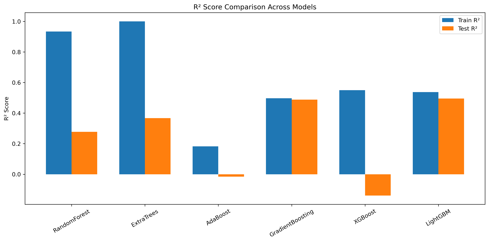
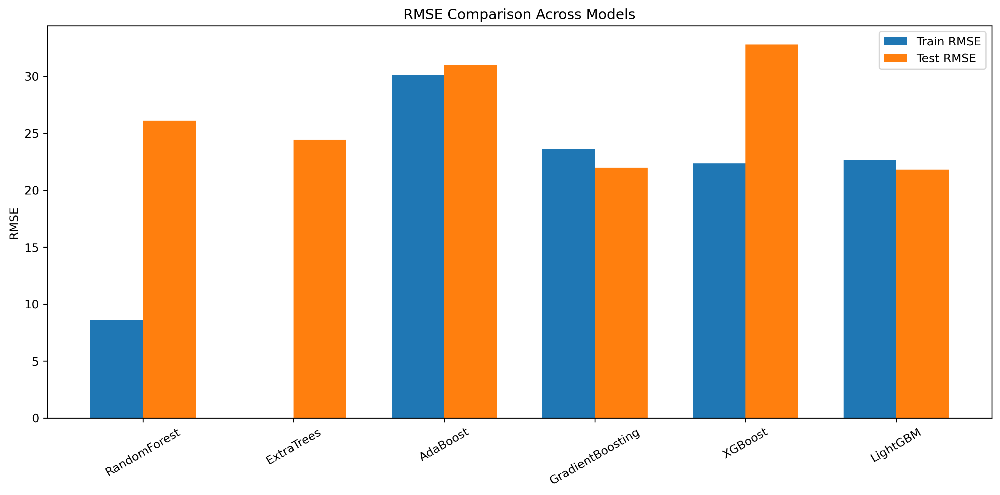

# 🎬 Cinema Audience Prediction

## Overview
In this project, I worked on predicting the **audience count for movie theaters on given dates** using real-world, highly noisy data. The dataset consisted of **theater metadata** (location, type, area, etc.) and **booking information** (tickets booked, tickets sold, dates).
A key challenge of this problem was **data incompleteness and inconsistency**. Although the dataset contained **826 unique theaters**, detailed theater metadata was available for only **~150 theaters**, with a significant amount of missing and misaligned information. 
The objective was to extract meaningful signals from this messy data and build a robust, reproducible machine learning pipeline.

---

## Problem Statement
Given:
- Theater details (latitude, longitude, theater type, area, etc.)
- Booking and ticket sales data across dates

Predict:
- **Audience count** for a given theater on a given date.
---
## Challenges
- Severe missing data in theater-level attributes  
- Sparse coverage of metadata across theaters  
- High variability in booking behavior  
- Strong temporal patterns and seasonality  
- Risk of data leakage due to time-based features  

---

## Methodology

### 1. Exploratory Data Analysis (EDA)
I began with extensive exploratory data analysis to understand:
- Audience count distributions
- Theater-wise booking behavior
- Temporal trends and seasonality
- Relationships between bookings, sales, and turnout

EDA revealed strong seasonal patterns, outliers, and non-linear relationships that guided subsequent feature engineering.

EDA-related code and notebooks are located in:
src/EDA

---
### 2. Feature Engineering
Based on insights from EDA, I engineered a comprehensive set of features, including:
- Temporal features (day, week, seasonality indicators)
- Aggregated booking and sales statistics
- Rolling and lag-based historical features
- Theater-level historical performance metrics

To ensure feature relevance, I validated features using statistical tests such as:
- Spearman correlation
- Kruskal–Wallis test
- Point-biserial correlation
- F-regression
- Mutual information regression

Only statistically significant and stable features were retained.

Feature engineering logic is organized under:
src/feature_extraction

---

### 3. Data Pipeline
I implemented an end-to-end data pipeline that handles:
- Data cleaning and preprocessing
- Missing value treatment
- Feature generation
- Feature selection
- Train–test splitting

The pipeline ensures reproducibility and prevents data leakage across experiments.

---

### 4. Model Training and Evaluation
I trained and evaluated multiple regression models, including:
- Linear Regression
- Ridge Regression
- Lasso Regression
- Decision Tree Regressor
- Random Forest Regressor
- Gradient Boosting Regressor
- XGBoost Regressor
- LightGBM Regressor

Models were evaluated using:
- **R² score**
- **Root Mean Squared Error (RMSE)**

All models were trained and tested using the same pipeline for fair comparison.

Model experimentation code is located in:
src/models

### 5. Model Comparison and Selection
I compared model performance using quantitative metrics and visual analysis. Performance comparison plots (R² and RMSE) were generated to assess:
- Predictive accuracy
- Generalization capability
- Bias–variance trade-offs

Based on these evaluations, I selected the final model that demonstrated the best balance between performance and robustness.

---

Plots are stored in:
src/plots 

---

## Project Structure

CinemaAudience2/
│
├── src/
│ ├── data/ # Raw and intermediate datasets
│ ├── EDA/ # Exploratory data analysis
│ ├── feature_extraction/ # Feature engineering logic
│ ├── preprocessing/ # Data cleaning and transformations
│ ├── models/ # Model training and experiments
│ ├── plots/ # Model comparison visualizations
│ └── submissions/ # Final predictions and outputs
│
├── myenv/ # Virtual environment
├── requirements.txt # Project dependencies
└── README.md

---

## Results
- Successfully extracted meaningful features from highly incomplete data
- Identified strong temporal and theater-level patterns
- Built a robust, reusable ML pipeline
- Achieved strong predictive performance using ensemble models
- Generated clear visual comparisons to support model selection

---

## Tech Stack
- Python
- Pandas, NumPy
- Scikit-learn
- XGBoost
- LightGBM
- Matplotlib, Seaborn

---

## Key Learnings
- Real-world datasets are messy; EDA is critical for feature design
- Statistical validation improves feature reliability
- Pipelines help prevent data leakage and improve reproducibility
- Model selection should balance accuracy and generalization

---

## Future Work
- Incorporate external signals such as holidays and events
- Explore advanced temporal and probabilistic models
- Improve coverage of theater metadata
- Deploy the final model for real-time inference

This project was completed as part of the **IIT Madras BS in Data Science** coursework.

